Deployment Order
- terraform/ (this in case use GKE, not used if on premise)
- metallb/ (if on premise)
- local-path-provisioner/ (if on premise)
- ingress-nginx/
- cert-manager/
- mysql/
- laravel/

in ubuntu pvc.yaml, if adjust the storageclassname based on where the kubernetes is deployed, if on premise the storageclassname it must be `local-path`, if is cloud based (like GKE), determine with getting the storageclassname using `kubectl get sc`

The Question:
1. Set up a Kubernetes cluster with an Ingress resource that is connected to
your domain name system (DNS).
2. Deploy a Kubernetes Service with persistent storage volume and establish a
connection to a database.
3. Demonstrate autoscaling of the Kubernetes Service to handle increased
workload.
4. Illustrate the continuous integration and continuous deployment (CI/CD)
process of the service by showcasing an example before and after the
deployment.

The Answer

1. I set up Kubernetes (GKE) using Terraform and placed the script in the `terraform` directory. I also set up the application with Ingress and a domain attached in the `laravel` directory.

Kubernetes Cluster (GKE)
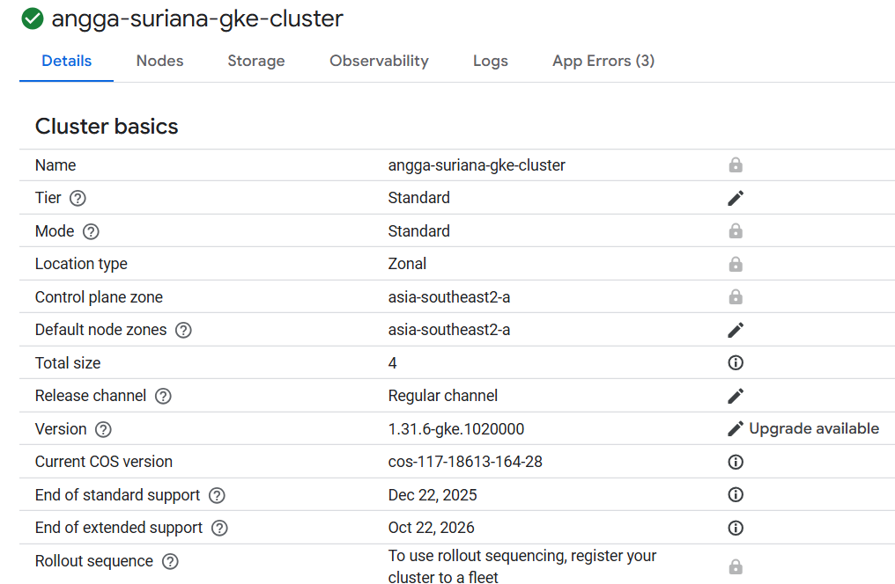

Application resource:
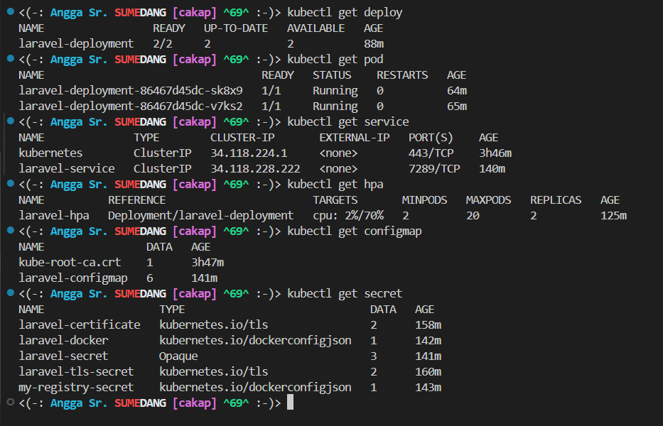

Active ingress with domain:
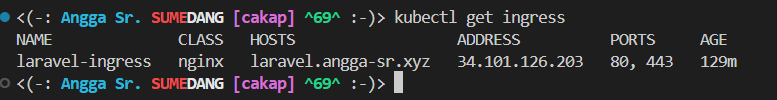

The application accessible using domain:
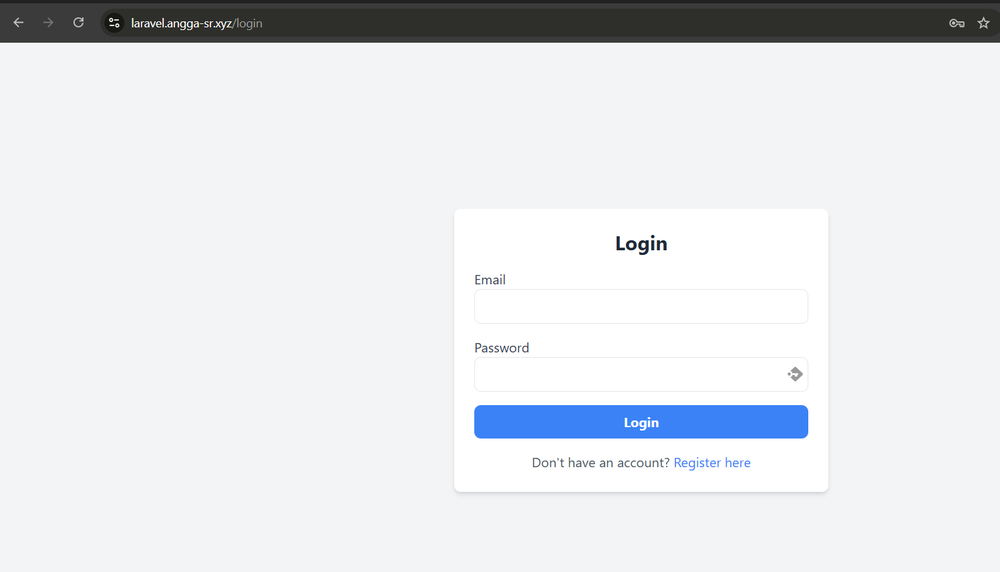

2. I have deployed a MySQL server using Helm, which is located in the `mysql` directory with persistent storage attached. The Laravel application in the `laravel` directory establishes a database connection to it.

MySQL resource with PV:
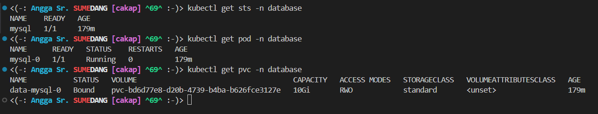

The application used that MySQL:
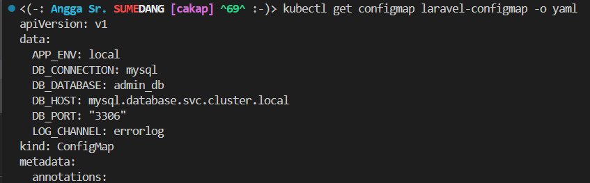

3. I set up the HPA for autoscaling the Laravel application. The configuration is in `laravel/hpa.yaml`, with a minimum scale of 2 and a maximum scale of 20.
When idle, 2 scale (default is 1, already scaled up by hpa):
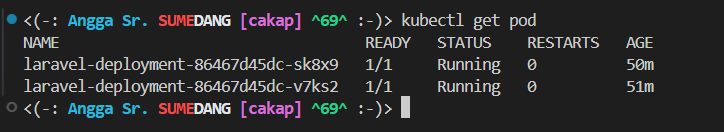

When scalled up (Hit by Loadium):
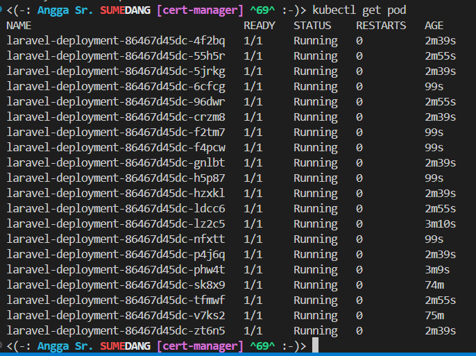
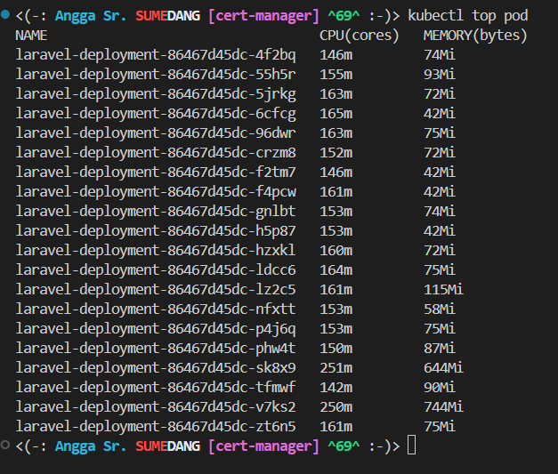
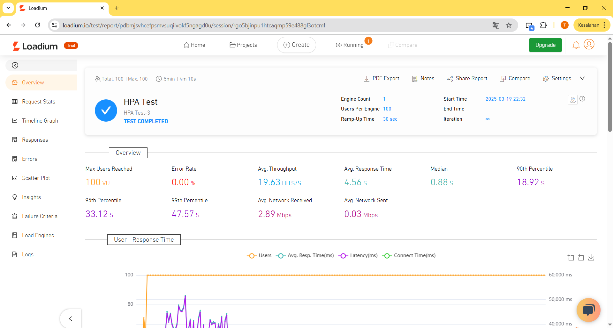

4. CI/CD Before and After Deployment 

Scenario: Incident response application adding discord id for notifications

A Laravel-based incident response app now let users link their discord id for real-time alerts. The CI/CD pipeline automates testing, integration, and deployment in the staging environment

### Before Deployment  

1. Development  
  - Add `discord_id` column to `users` to store discord id
  - Push code to `feature/discord-notifications` branch

2. Continuous Integration 
  - Create a pull request to merge into `staging`  
    - Run unit tests  
    - Check code style  
    - Verify database migration for `discord_id`  
  - If tests pass, merge PR into `staging`

3. Pre-Deployment State  
  - Feature exists in code but isn't live  
  - `discord_id` column not in `users` table yet 

### After Deployment  

1. Continuous Deployment 
  - After merging, the CD pipeline  
    - Pulls latest code from `staging`  
    - Installs dependencies (`composer install`)  
    - Runs `php artisan migrate` to add `discord_id`  
    - Clears caches and deploys the app

2. Post-Deployment State  
  - "Discord id for notifications" is live  
  - `discord_id` column exists in `users` table  
  - Users can link discord id and get notifications

### Before vs. After Deployment  
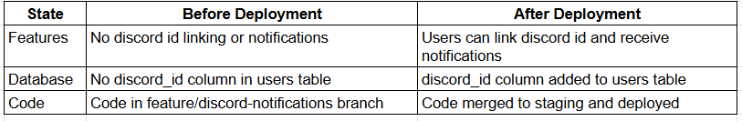

### CI/CD Flow

#### Before Deployment (CI)

#### After Deployment (CD)  
